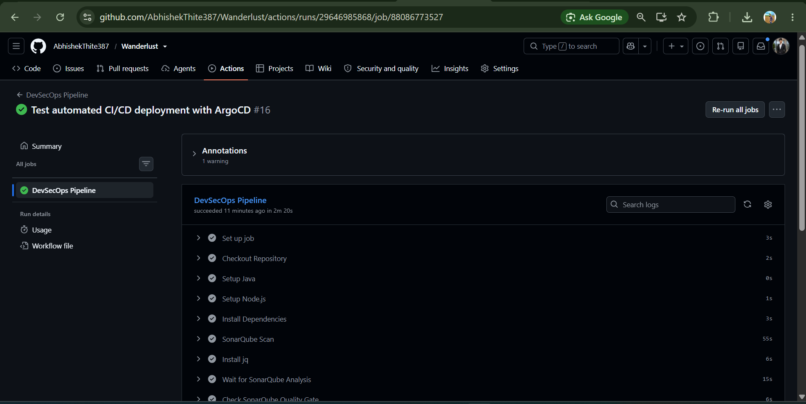
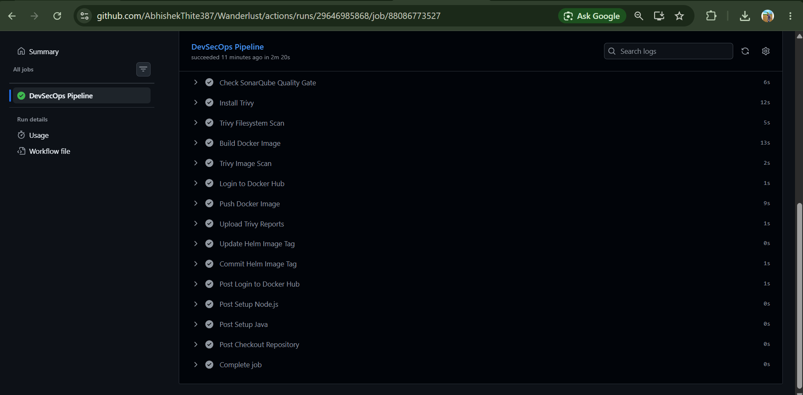
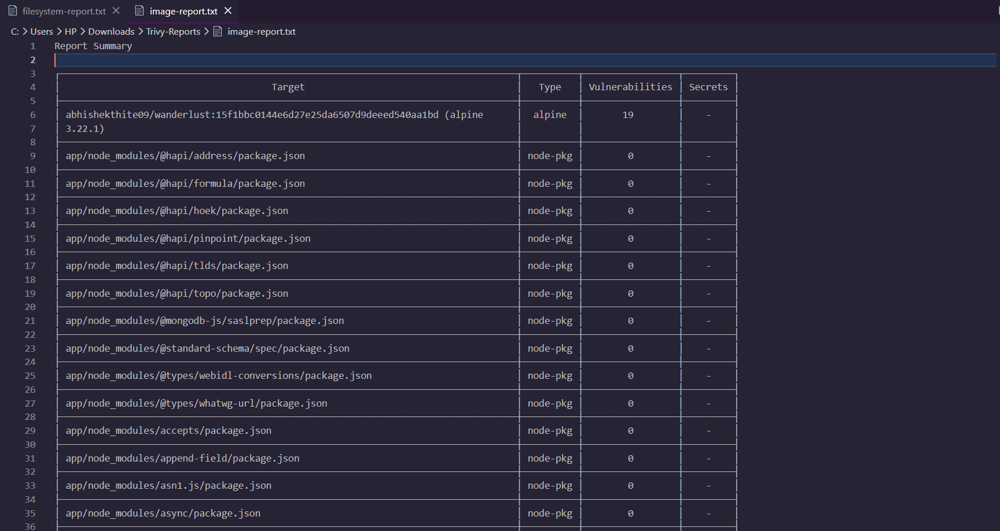
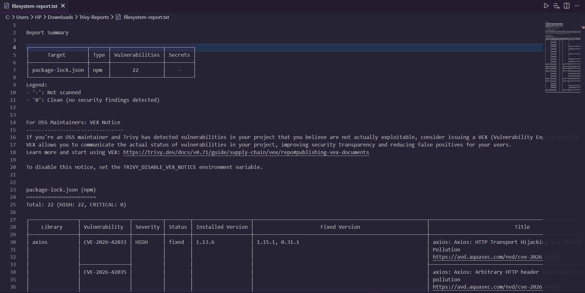
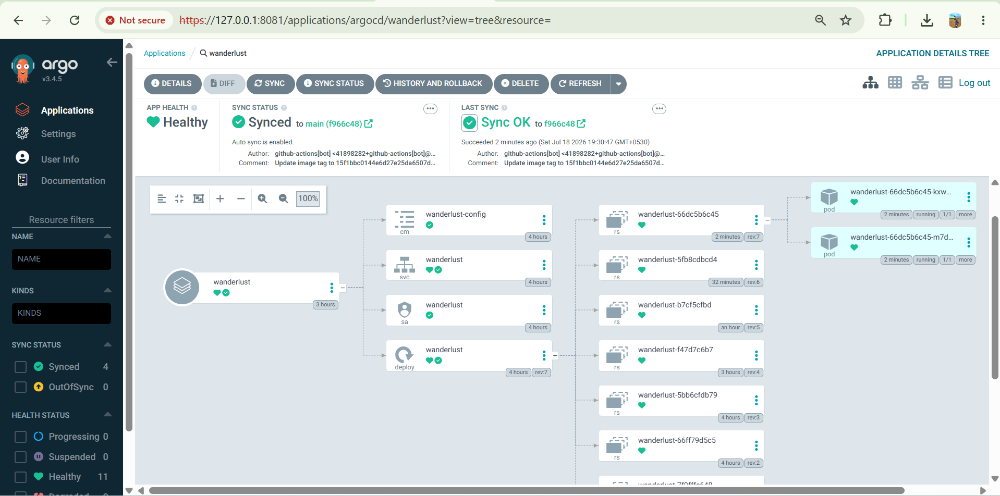
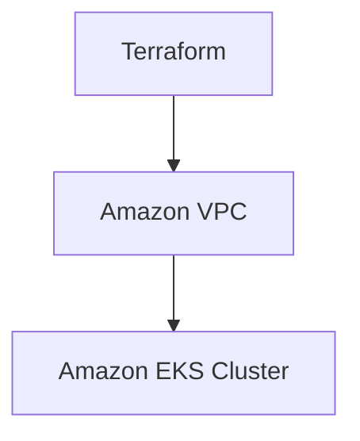

<div align="center">

# 🌍 Wanderlust

### Full Stack Travel Listing Platform — with a Production-Style DevSecOps + GitOps Pipeline

**Node.js · Express · MongoDB · Docker · Terraform · Kubernetes (EKS) · Helm · ArgoCD**

[](https://nodejs.org/)
[](https://expressjs.com/)
[](https://www.mongodb.com/)
[](https://www.docker.com/)
[](https://github.com/features/actions)
[](https://www.sonarsource.com/products/sonarqube/)
[](https://aquasecurity.github.io/trivy/)
[](https://www.terraform.io/)
[](https://kubernetes.io/)
[](https://aws.amazon.com/eks/)
[](https://helm.sh/)
[](https://argo-cd.readthedocs.io/)
[](#-license)

[](https://git.io/typing-svg)

</div>

---

## 🏛️ DevSecOps + GitOps Architecture

<p align="center"></p>,

---

## 📖 Table of Contents

- [Project Overview](#-project-overview)
- [Key Features](#-key-features)
- [Screenshots / Demo](#-screenshots--demo)
- [Technology Stack](#-technology-stack)
- [DevSecOps + GitOps Architecture](#-devsecops--gitops-architecture)
- [CI/CD Pipeline Explained](#-cicd-pipeline-explained)
- [Security Integration](#-security-integration)
- [Infrastructure as Code — Terraform](#-infrastructure-as-code--terraform)
- [Kubernetes & Amazon EKS](#-kubernetes--amazon-eks)
- [Helm Deployment](#-helm-deployment)
- [ArgoCD GitOps Continuous Deployment](#-argocd-gitops-continuous-deployment)
- [Fully Automated Deployment](#-fully-automated-deployment)
- [Project Directory Structure](#-project-directory-structure)
- [Prerequisites](#-prerequisites)
- [Local Installation](#-local-installation)
- [Docker Setup](#-docker-setup)
- [Infrastructure Deployment (Terraform)](#-infrastructure-deployment-terraform)
- [Kubernetes / Helm Deployment](#-kubernetes--helm-deployment)
- [ArgoCD Setup](#-argocd-setup)
- [GitHub Actions Secrets](#-github-actions-secrets)
- [Future Improvements](#-future-improvements)
- [Author](#-author)
- [License](#-license)

---

## 🚀 Project Overview

Wanderlust is a full-stack, Airbnb-inspired travel/property listing web application — **and** a complete, automated **DevSecOps + GitOps deployment pipeline** running on AWS.

**A. The Application**
A server-rendered full-stack platform built on the **MVC (Model-View-Controller)** architecture using **Node.js**, **Express.js**, **EJS**, and **MongoDB**. Users can sign up, browse listings on an interactive map, create and manage their own listings, and leave reviews.

**B. The DevOps Architecture**
Beyond the application layer, this repository demonstrates a production-style delivery pipeline: every code change is automatically built, statically analyzed, security-scanned, containerized, and deployed to a **Kubernetes cluster on Amazon EKS** — with **Terraform** provisioning the underlying AWS infrastructure, **Helm** managing Kubernetes configuration, and **ArgoCD** continuously syncing the cluster to the desired state defined in Git.

In short: **Git is the source of truth.** A developer only needs to push code — the pipeline handles the rest, all the way to a live rolling deployment on EKS.

---

## ✨ Key Features

### Application

- 🔐 User Signup, Login, Logout (session-based authentication)
- 🏠 Create, view, edit, and delete listings
- 💬 Add and delete reviews
- 🗺️ Interactive maps using Leaflet.js
- 📱 Fully responsive UI built with Bootstrap 5

### DevSecOps / Infrastructure

- 🐳 Dockerized application
- ⚙️ Automated CI/CD pipeline via GitHub Actions
- 📊 SonarQube static code analysis
- ✅ SonarQube Quality Gate validation
- 🛡️ Trivy filesystem vulnerability scanning
- 🛡️ Trivy Docker image vulnerability scanning
- 📦 Automated Docker image publishing to Docker Hub
- 🏷️ Commit-SHA-based Docker image versioning (immutable tags)
- 🏗️ Terraform-provisioned AWS infrastructure (Infrastructure as Code)
- ☸️ Kubernetes deployment on Amazon EKS
- ⛵ Helm-based Kubernetes configuration management
- 🔄 ArgoCD GitOps continuous deployment
- 🔁 Automatic Git-to-cluster synchronization
- 🚀 Kubernetes rolling updates with zero-downtime pod replacement

---

## 📸 Screenshots / Demo

### 🏠 Home Page
<p align="center"></p>

### 🔍 Listing Details
<p align="center"></p>

### 🔐 Signup Page
<p align="center"></p>

### 🗺️ Map & Reviews
<p align="center"></p>

### ⚙️ GitHub Actions CI/CD Pipeline
<p align="center"></p>

<p align="center"></p>

### 📊 SonarQube Analysis
<p align="center"></p>

### 🛡️ Trivy Security Reports
<p align="center"></p>

<p align="center"></p>

### 🔄 ArgoCD GitOps Dashboard
<p align="center"></p>
<!-- Add screenshots/argocd.png showing the ArgoCD application sync status -->


---

## 🛠️ Technology Stack

| Category | Technologies |
|---|---|
| **Frontend / Templating** | HTML5, CSS3, Bootstrap 5, JavaScript, EJS, Leaflet.js, Font Awesome |
| **Backend** | Node.js, Express.js |
| **Database** | MongoDB Atlas, Mongoose |
| **Authentication** | Passport.js, Express-Session, Connect-Flash |
| **Version Control** | Git, GitHub |
| **CI/CD** | GitHub Actions |
| **Code Quality** | SonarQube Community Edition |
| **Security** | Trivy (Filesystem & Image Scanning) |
| **Containerization** | Docker |
| **Container Registry** | Docker Hub |
| **Infrastructure as Code** | Terraform |
| **Cloud** | AWS (VPC, EKS) |
| **Orchestration** | Kubernetes (Amazon EKS) |
| **Package Management** | Helm |
| **GitOps** | ArgoCD |

---


## 🔁 CI/CD Pipeline Explained

The workflow is split into two clearly separated phases:

**CI — Continuous Integration** (`GitHub Actions + SonarQube + Trivy + Docker`)
1. Developer pushes code changes to the `main` branch.
2. GitHub Actions triggers automatically.
3. Project dependencies are installed.
4. SonarQube performs static code analysis.
5. The SonarQube Quality Gate validates code quality.
6. Trivy scans the repository filesystem for vulnerabilities.
7. The Docker image is built.
8. Trivy scans the built Docker image.
9. GitHub Actions authenticates with Docker Hub.
10. The image is pushed to Docker Hub, tagged with the **Git commit SHA** (e.g. `username/wanderlust:<github-sha>`), with `latest` also pushed where applicable.

**CD — GitOps** (`Git + Helm + ArgoCD + Kubernetes + Amazon EKS`)
11. GitHub Actions updates the image tag in the Helm `values.yaml` to the new Git SHA.
12. A GitHub Actions bot commits this configuration change back to the repository.
13. ArgoCD, which continuously watches the Git repository, detects the change.
14. ArgoCD automatically synchronizes the cluster's actual state to the new desired state — **no manual `kubectl` deployment or manual ArgoCD Sync is required** for normal application updates.
15. Helm applies the updated configuration to Amazon EKS.
16. Kubernetes performs a rolling update: new pods are created and health-checked.
17. Old pods are terminated once the new pods are ready.
18. The updated Wanderlust application becomes available through the Kubernetes LoadBalancer Service.

> **GitOps principle:** Git is the single source of truth for the desired deployment state. CI is responsible for producing and publishing a new, verified artifact; ArgoCD is responsible for reconciling the cluster to match Git.

---

## 🛡️ Security Integration

Security checks are integrated directly into the CI/CD workflow rather than treated as a separate, manual process.

**SonarQube**
- Static code analysis on every push
- Code quality and maintainability checks
- Quality Gate enforcement before the pipeline proceeds

**Trivy**
- Filesystem vulnerability scanning of source code and dependencies
- Docker image vulnerability scanning after the image is built
- Visibility into HIGH and CRITICAL severity findings

Scan reports are generated as part of the standard pipeline run, giving continuous visibility into the project's security posture on every commit.

---

## 🏗️ Infrastructure as Code — Terraform

AWS infrastructure for Wanderlust is provisioned using **Terraform**, defined under `terraform/`.



At minimum, Terraform provisions:
- **Amazon VPC** — the networking foundation for the cluster
- **Amazon EKS Cluster** — the managed Kubernetes control plane and node infrastructure

> If your `terraform/` configuration also provisions additional resources (public/private subnets, an Internet Gateway, NAT Gateway, route tables, dedicated EKS node groups, or IAM roles), list them here for full accuracy.

---

## ☸️ Kubernetes & Amazon EKS

The application runs on a managed **Amazon EKS** cluster. Kubernetes handles:

- Scheduling and running application pods
- Rolling updates with zero downtime
- Exposing the application through a **LoadBalancer Service**
- Automatically replacing unhealthy pods

---

## ⛵ Helm Deployment

Kubernetes resources are packaged and managed with **Helm**, with the chart located at:

```
helm/wanderlust/
```

The chart manages core Kubernetes resources, including:
- Deployment
- Service
- ConfigMap
- Secret template
- ServiceAccount

Key configurable values in `values.yaml`:

| Value | Purpose |
|---|---|
| `image.repository` | Docker Hub repository for the application image |
| `image.tag` | Image tag — updated automatically to the Git commit SHA by CI |
| `image.pullPolicy` | Image pull behavior for the cluster |
| `replicaCount` | Number of application pod replicas |
| `service.*` | Service type and port configuration |

> ⚠️ Sensitive production values (database URIs, session secrets, etc.) are **not** committed directly to the repository — they are supplied via Kubernetes Secrets at deploy time.

---

## 🔄 ArgoCD GitOps Continuous Deployment

**ArgoCD** continuously monitors the GitHub repository and keeps the Amazon EKS cluster in sync with the desired state defined there.

- Git holds the desired Kubernetes deployment state (via the Helm chart and `values.yaml`).
- GitHub Actions is responsible for CI, security checks, building/publishing the Docker image, and updating the Helm image tag.
- ArgoCD detects the Git change and performs an **Auto Sync**, applying the updated state to the cluster.
- Kubernetes then carries out a standard rolling deployment.

**No manual `kubectl` deployment or manual ArgoCD Sync is required for normal application updates** — this reflects the currently configured automatic sync behavior.

**GitOps principle:** `Git = Source of Truth`

---

## ⚡ Fully Automated Deployment

Once the infrastructure and ArgoCD are configured, the day-to-day delivery workflow requires nothing beyond a code change:

```
Code Change
   → Git Push
   → CI Pipeline (SonarQube + Trivy)
   → Docker Build & Push
   → Helm values.yaml Tag Update
   → ArgoCD Auto Sync
   → EKS Rolling Deployment
   → Application Live
```

No manual intervention is needed between pushing code and the change being live on Amazon EKS.

---

## 📂 Project Directory Structure

```
Wanderlust/
├── .github/                    # GitHub Actions CI/CD workflows
├── controllers/                # Route logic (Controller layer)
├── DevSecOps-Lab/               # DevSecOps related lab/config assets
├── helm/
│   └── wanderlust/             # Helm chart for the application deployment
│       ├── charts/             # Chart dependencies
│       ├── templates/          # Kubernetes manifest templates
│       ├── .helmignore
│       ├── Chart.yaml
│       ├── secrets-values.yaml # Secret value references (not committed with real values)
│       └── values.yaml         # Configurable deployment values (image tag, replicas, etc.)
├── init/                       # Database seeding/initialization scripts
├── k8s/                        # Raw Kubernetes manifests
├── models/                     # Mongoose schemas (Model layer)
├── public/                     # Static assets (CSS, client JS, images)
├── routes/                     # Express route definitions
├── screenshots/                # README screenshots
├── scripts/                    # Utility/automation scripts
├── terraform/                  # Terraform IaC — AWS VPC & EKS provisioning
├── uploads/                    # Uploaded media files
├── utlis/                      # Utility/helper modules
├── views/                      # EJS templates (View layer)
│   ├── includes/
│   ├── layouts/
│   ├── listings/
│   ├── users/
│   └── error.ejs
├── .dockerignore
├── .env
├── .gitignore
├── app.js                      # Application entry point
├── cloudConfig.js              # Cloud storage configuration
├── docker-compose.yml
├── dockerfile
├── middleware.js               # Custom Express middleware
├── package.json
├── package-lock.json
├── README.md
├── schema.js                   # Data validation schemas
└── sonar-project.properties    # SonarQube configuration
```

---

## ✅ Prerequisites

- Node.js and npm
- MongoDB Atlas account
- Docker
- Terraform CLI
- AWS CLI configured with appropriate credentials
- `kubectl`
- Helm CLI
- ArgoCD (CLI and/or access to an ArgoCD instance)

---

## 💻 Local Installation

```bash
# 1. Clone the repository
git clone https://github.com/AbhishekThite387/Wanderlust.git
cd Wanderlust

# 2. Install dependencies
npm install

# 3. Configure environment variables
# Create a .env file with:
# ATLASDB_URL=<YOUR_MONGODB_URI>
# SECRET=<YOUR_SESSION_SECRET>

# 4. Run the application
npm start
# or, for development:
nodemon app.js
```

App runs locally at: `http://localhost:8080`

---

## 🐳 Docker Setup

```bash
# Build the image
docker build -t wanderlust .

# Run the container
docker run -p 8080:8080 --env-file .env wanderlust

# Pull the published image from Docker Hub
docker pull <YOUR_DOCKER_USERNAME>/wanderlust:latest
```

---

## 🏗️ Infrastructure Deployment (Terraform)

```bash
cd terraform/

terraform init
terraform plan
terraform apply
```

This provisions the AWS VPC and Amazon EKS cluster used to run the application.

---

## ☸️ Kubernetes / Helm Deployment

```bash
# Configure kubectl for the EKS cluster
aws eks update-kubeconfig --name <YOUR_EKS_CLUSTER_NAME> --region <YOUR_AWS_REGION>

# Deploy/upgrade via Helm
helm upgrade --install wanderlust helm/wanderlust/ \
  --set image.repository=<YOUR_DOCKER_USERNAME>/wanderlust \
  --set image.tag=<GIT_SHA_OR_TAG>
```

> In normal operation, this Helm step is performed automatically by ArgoCD, not run manually.

---

## 🔄 ArgoCD Setup

```bash
# Install ArgoCD into the cluster (if not already installed)
kubectl create namespace argocd
kubectl apply -n argocd -f https://raw.githubusercontent.com/argoproj/argo-cd/stable/manifests/install.yaml

# Register the application with ArgoCD, pointing at the Helm chart path
argocd app create wanderlust \
  --repo <YOUR_GIT_REPO_URL> \
  --path helm/wanderlust \
  --dest-server https://kubernetes.default.svc \
  --dest-namespace default \
  --sync-policy automated
```

Once created with an automated sync policy, ArgoCD keeps the cluster continuously synchronized with Git.

---

## 🔐 GitHub Actions Secrets

The pipeline relies on the following repository secrets (values are never exposed in the codebase):

| Secret | Purpose |
|---|---|
| `SONAR_TOKEN` | Authenticates the pipeline with the SonarQube server for static analysis |
| `SONAR_HOST_URL` | URL of the SonarQube server used for scanning |
| `DOCKER_USERNAME` | Docker Hub username for authenticating image pushes |
| `DOCKER_PASSWORD` | Docker Hub password/access token for authenticating image pushes |

> Additional secrets (e.g. AWS credentials for cluster access) may be required depending on your specific AWS/ArgoCD setup — configure these as repository secrets as needed, and never commit them to the repository.

---

## 🔮 Future Improvements

> The items below are **not currently implemented** — they represent planned enhancements.

- Separate application and GitOps configuration repositories
- HTTPS / TLS termination
- Custom domain
- Prometheus and Grafana monitoring
- Centralized logging
- Argo Rollouts for Blue/Green or Canary deployments
- External Secrets / AWS Secrets Manager integration
- AWS Load Balancer Controller
- Enhanced observability

---

## 👨‍💻 Author

**Abhishek Thite**
🔗 GitHub: [AbhishekThite387](https://github.com/AbhishekThite387)

---

## 📜 License

This project is licensed under the **MIT License**.

<div align="center">

⭐ If you found this project useful, consider giving it a star!

</div>
