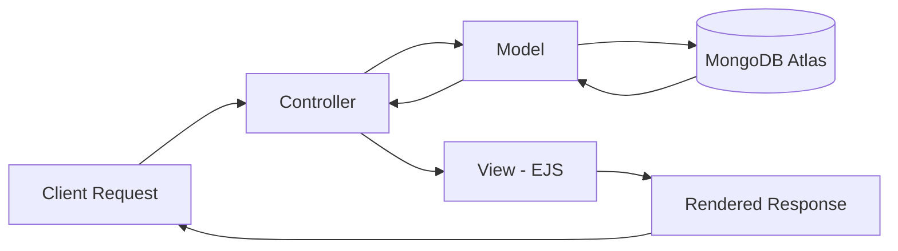
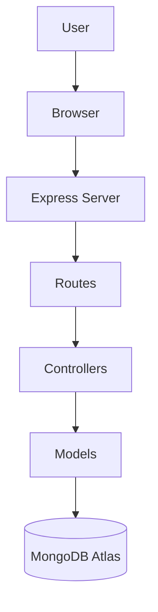
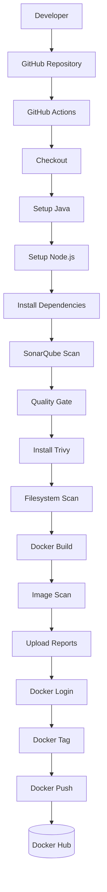
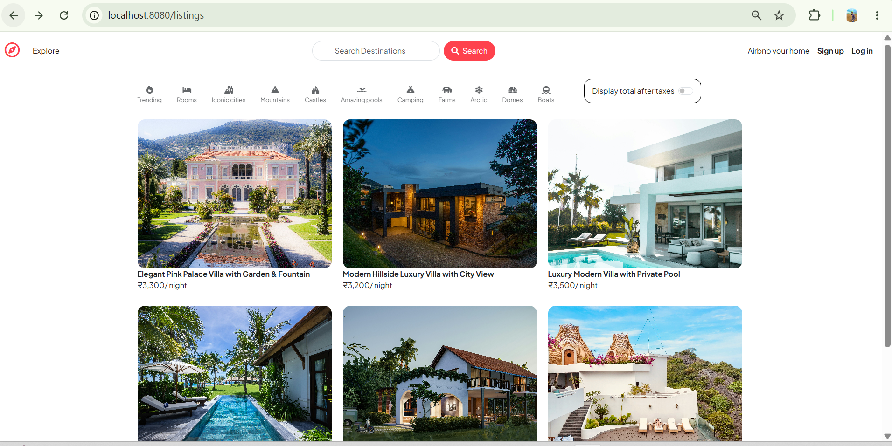
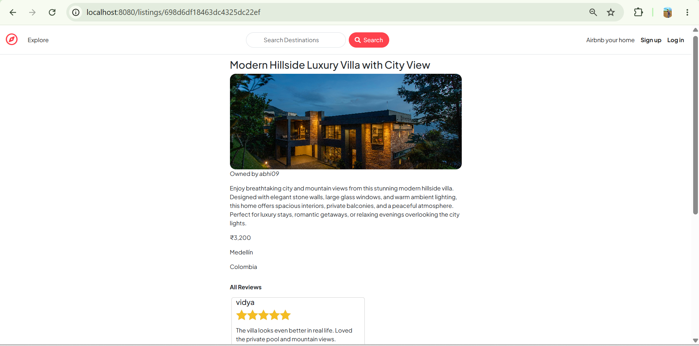
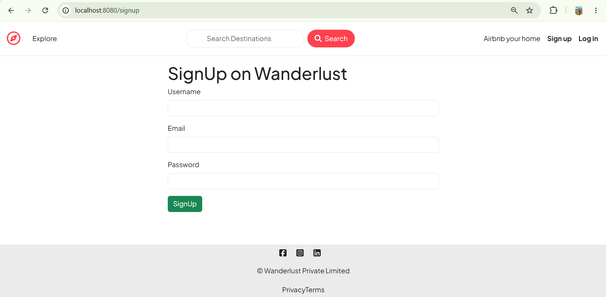
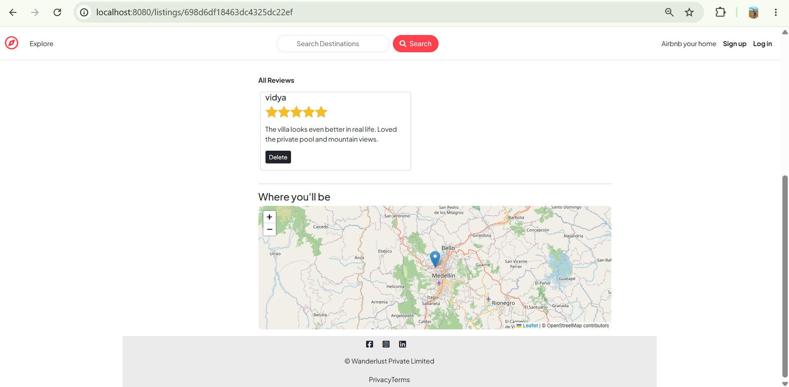
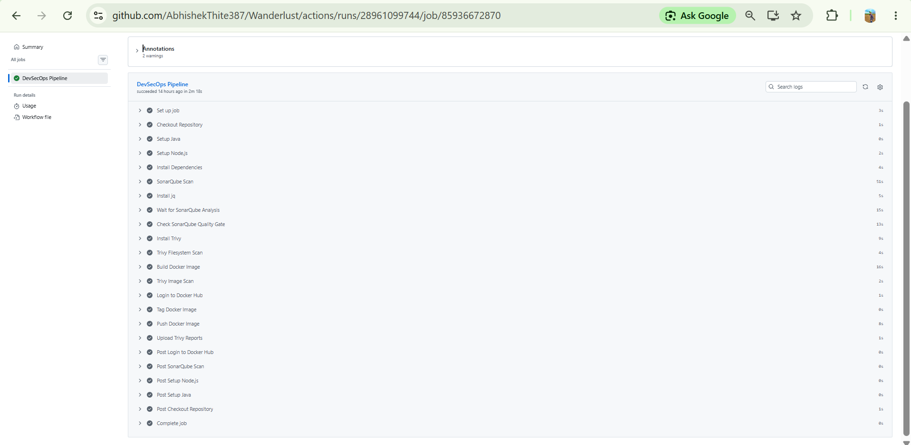
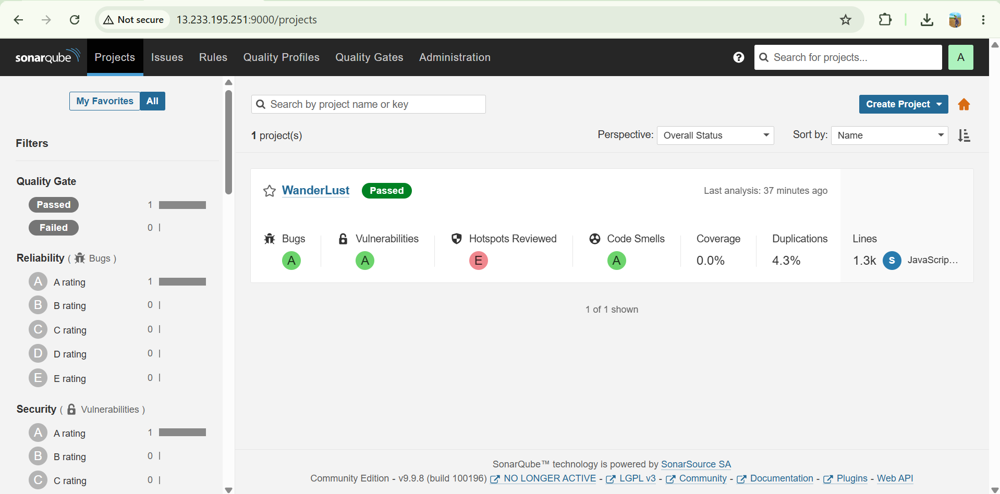
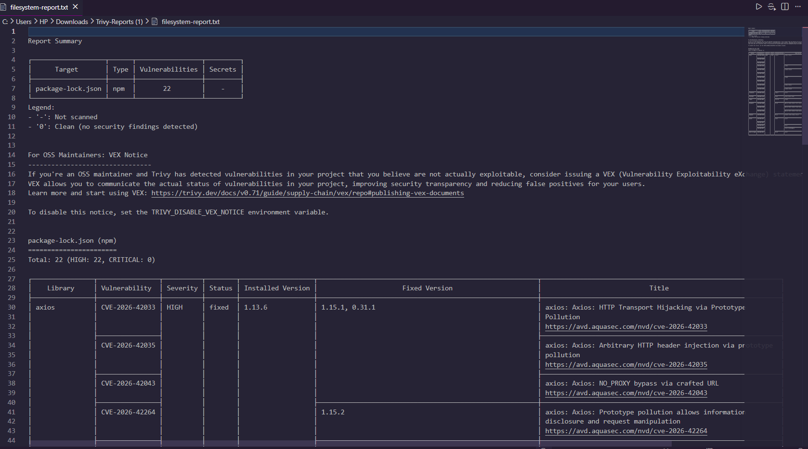

<div align="center">

# 🌍 Wanderlust

### Full Stack Travel Listing Platform — Airbnb Inspired

**Node.js · Express · MongoDB · Docker · DevSecOps**

[](https://nodejs.org/)
[](https://expressjs.com/)
[](https://www.mongodb.com/)
[](https://getbootstrap.com/)
[](https://developer.mozilla.org/en-US/docs/Web/JavaScript)
[](https://www.docker.com/)
[](https://github.com/features/actions)
[](https://www.sonarsource.com/products/sonarqube/)
[](https://aquasecurity.github.io/trivy/)
[](https://www.passportjs.org/)
[](#-mvc-architecture)
[](#-license)

[](https://git.io/typing-svg)

</div>

---

## 📖 Table of Contents

- [Project Overview](#-project-overview)
- [Why Wanderlust?](#-why-wanderlust)
- [Features](#-features)
- [Tech Stack](#-tech-stack)
- [MVC Architecture](#-mvc-architecture)
- [System Architecture](#-system-architecture)
- [DevSecOps CI Pipeline](#-devsecops-ci-pipeline)
- [Project Structure](#-project-structure)
- [Installation](#-installation)
- [Environment Variables](#-environment-variables)
- [Docker](#-docker)
- [GitHub Actions CI](#-github-actions-ci)
- [Security](#-security)
- [Screenshots](#-screenshots)
- [Future Roadmap](#-future-roadmap)
- [Author](#-author)
- [License](#-license)

---

## 🚀 Project Overview

**Wanderlust** is a full-stack, Airbnb-inspired travel listing platform where users can discover, create, and review property listings on an interactive map. It is built on the classic **MVC (Model-View-Controller)** architecture using **Node.js**, **Express.js**, and **MongoDB**, with server-rendered views powered by **EJS** and a responsive **Bootstrap 5** interface.

**Purpose:** Wanderlust exists to demonstrate a complete, production-style full-stack workflow — from a well-structured MVC codebase to an automated, security-focused CI pipeline that builds, scans, and publishes a containerized version of the application on every push.

**Architecture:** The application strictly separates data (Models), presentation (Views), and request handling (Controllers/Routes), keeping the codebase modular and easy to extend.

---

## 💡 Why Wanderlust?

**From a user's perspective**, Wanderlust behaves like a simplified Airbnb: users sign up, browse listings with location context on a map, create their own listings, and leave reviews on places they've explored — all through a clean, responsive interface.

**From a technical perspective**, this project demonstrates:

- Building a server-rendered full-stack application with proper MVC separation
- Implementing secure, session-based authentication and authorization
- Designing RESTful routes and controller logic in Express.js
- Modeling and querying data with Mongoose against MongoDB Atlas
- Containerizing an application with Docker for consistent, portable builds
- Designing a real **DevSecOps pipeline** — static code analysis, dependency and image vulnerability scanning, and automated container publishing — using GitHub Actions, SonarQube, and Trivy

---

## ✨ Features

### 🔐 Authentication

- User Signup
- User Login
- Logout

### 🏠 Listings

- Create Listing
- View Listings
- Edit Listing
- Delete Listing

### 💬 Reviews

- Add Reviews
- Delete Reviews

### 🗺️ Maps

- Interactive maps using Leaflet.js

### 📱 Responsive Design

- Fully responsive UI built with Bootstrap 5

### 🛡️ Security

- Authentication & Authorization
- Session Management

### 🐳 Containerization

- Fully Dockerized application

### ⚙️ DevSecOps

- SonarQube Static Code Analysis
- SonarQube Quality Gate
- Trivy Filesystem Scan
- Trivy Docker Image Scan
- Docker Image Build
- Docker Hub Push
- GitHub Actions CI Pipeline

---

## 🛠️ Tech Stack

| Category               | Technologies                                                        |
| ---------------------- | ------------------------------------------------------------------- |
| **Frontend**           | HTML5, CSS3, Bootstrap 5, JavaScript, EJS, Leaflet.js, Font Awesome |
| **Backend**            | Node.js, Express.js                                                 |
| **Database**           | MongoDB Atlas, Mongoose                                             |
| **Authentication**     | Passport.js, Express-Session, Connect-Flash                         |
| **Containerization**   | Docker                                                              |
| **Code Quality**       | SonarQube Community Edition                                         |
| **Security Scanning**  | Trivy                                                               |
| **CI**                 | GitHub Actions                                                      |
| **Container Registry** | Docker Hub                                                          |

---

## 🏗️ MVC Architecture

Wanderlust strictly follows the **Model–View–Controller** pattern.

| Layer          | Responsibility                         | Location                  |
| -------------- | -------------------------------------- | ------------------------- |
| **Model**      | Mongoose schemas & MongoDB data access | `models/`, `schema.js`    |
| **View**       | EJS templates rendered to the client   | `views/`                  |
| **Controller** | Request handling & business logic      | `controllers/`, `routes/` |



---

## 🧩 System Architecture



---

## 🔄 DevSecOps CI Pipeline



**CI Status:** ✅ Completed Successfully

---

## 📂 Project Structure

Structure below reflects the actual repository layout.

```
Wanderlust/
├── .github/
│   └── workflows/
│       └── devsecops.yml       # GitHub Actions CI pipeline
├── controllers/                # Route logic (Controller layer)
├── DevSecOps-Lab/               # DevSecOps related lab/config assets
├── init/                       # Database seeding/initialization scripts
├── models/                     # Mongoose schemas (Model layer)
├── node_modules/               # Installed dependencies
├── public/                     # Static assets (CSS, client JS, images)
├── routes/                     # Express route definitions
├── scripts/                    # Utility/automation scripts
├── uploads/                    # Uploaded media files
├── utlis/                      # Utility/helper modules
├── views/                      # EJS templates (View layer)
├── .dockerignore
├── .env
├── .gitignore
├── app.js                      # Application entry point
├── cloudConfig.js              # Cloud storage configuration
├── docker-compose.yml          # Multi-container orchestration
├── dockerfile                  # Docker image build instructions
├── middleware.js               # Custom Express middleware
├── package.json
├── package-lock.json
├── README.md
├── schema.js                   # Data validation schemas
└── sonar-project.properties    # SonarQube configuration
```

---

## ⚙️ Installation

### 1. Clone the repository

```bash
git clone https://github.com/AbhishekThite387/Wanderlust.git
cd Wanderlust
```

### 2. Install dependencies

```bash
npm install
```

### 3. Configure environment variables

Create a `.env` file in the root directory (see [Environment Variables](#-environment-variables)).

### 4. Run the application

```bash
npm start
```

or, for development with auto-reload:

```bash
nodemon app.js
```

The app will be available at:

```
http://localhost:8080
```

### 5. Build the Docker image

```bash
docker build -t wanderlust .
```

### 6. Run the container

```bash
docker run -p 8080:8080 --env-file .env wanderlust
```

---

## 🔑 Environment Variables

| Variable      | Description                              |
| ------------- | ---------------------------------------- |
| `ATLASDB_URL` | MongoDB Atlas connection string          |
| `SECRET`      | Session secret used by `express-session` |

> ⚠️ Never commit your `.env` file. It is already excluded via `.gitignore`.

---

## 🐳 Docker

The application is fully containerized for consistent, portable builds.

- **`dockerfile`** — defines how the Node.js application image is built (base image, dependencies, entry point).
- **`docker-compose.yml`** — used for orchestrating the application container locally.
- **Docker Hub** — every successful pipeline run publishes a new image tag to Docker Hub.

```bash
# Build the image
docker build -t wanderlust .

# Run the container
docker run -p 8080:8080 --env-file .env wanderlust

# Pull the published image from Docker Hub
docker pull <dockerhub-username>/wanderlust:latest
```

---

## 🔁 GitHub Actions CI

The pipeline is defined in [`.github/workflows/devsecops.yml`](.github/workflows/devsecops.yml) and runs automatically on every push.

| Step                      | Purpose                                                            |
| ------------------------- | ------------------------------------------------------------------ |
| **Checkout Repository**   | Pulls the latest source code into the runner                       |
| **Setup Java**            | Provisions the JVM required to run the SonarQube scanner           |
| **Setup Node.js**         | Installs the Node.js runtime for the application                   |
| **Install Dependencies**  | Runs `npm install` to resolve project packages                     |
| **SonarQube Scan**        | Performs static code analysis for bugs and code smells             |
| **Quality Gate**          | Fails the pipeline if code doesn't meet defined quality thresholds |
| **Install Trivy**         | Sets up the Trivy vulnerability scanner                            |
| **Trivy Filesystem Scan** | Scans the source tree and dependencies for known CVEs              |
| **Docker Build**          | Builds the application's Docker image                              |
| **Image Scan**            | Scans the built image for vulnerabilities with Trivy               |
| **Upload Reports**        | Stores Trivy scan results as pipeline artifacts                    |
| **Docker Login**          | Authenticates with Docker Hub                                      |
| **Docker Tag**            | Tags the built image appropriately                                 |
| **Docker Push**           | Publishes the image to Docker Hub                                  |

---

## 🛡️ Security

- **SonarQube (Community Edition)** — analyzes code quality, maintainability, and potential vulnerabilities on every push.
- **Quality Gate** — automated checkpoint; the pipeline stops if code quality falls below the configured standard.
- **Trivy Filesystem Scan** — scans project dependencies and source files for known vulnerabilities before the image is built.
- **Trivy Docker Image Scan** — scans the final Docker image layers for vulnerabilities prior to publishing to Docker Hub.

---

## 📸 Screenshots

### 🏠 Home Page

<p align="center">
  
</p>

---

### 🔍 Listing Details

<p align="center">
  
</p>

---

### 🔐 Signup Page

<p align="center">
  
</p>

---

### 🔍 Map & Reviews Details

<p align="center">
  
</p>

---

### ⚙️ GitHub Actions CI Pipeline

<p align="center">
  
</p>

---

### 📊 SonarQube Dashboard

<p align="center">
  
</p>

---

### 🛡️ Trivy Scan Report

<p align="center">
  
</p>

---

## 🗺️ Future Roadmap

**Completed**

- [x] Full Stack Application (MVC Architecture)
- [x] Authentication & Session Management
- [x] Dockerized Application
- [x] SonarQube Static Analysis & Quality Gate
- [x] Trivy Filesystem & Image Scanning
- [x] GitHub Actions CI Pipeline
- [x] Docker Hub Image Push

**Current**

- [ ] 🚧 AWS EC2 Deployment (CD) — _In Progress_

**Future**

- [ ] Nginx Reverse Proxy
- [ ] Docker Compose based multi-service setup
- [ ] HTTPS / SSL
- [ ] Kubernetes
- [ ] ArgoCD
- [ ] Prometheus
- [ ] Grafana

---

## 👨‍💻 Author

**Abhishek Thite**
🔗 GitHub: [AbhishekThite387](https://github.com/AbhishekThite387)

---

## 📜 License

This project is licensed under the **MIT License**.

<div align="center">

⭐ If you found this project useful, consider giving it a star!

</div>
